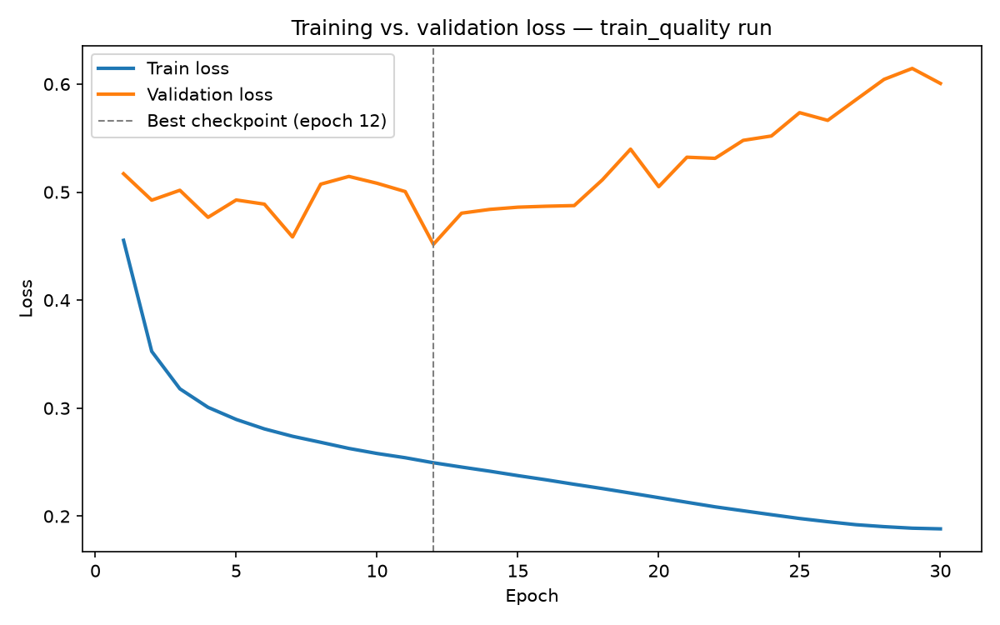

# keshik (کشیک)

> Battery-powered AI sentry — on-device person detection with LoRa alerts.
> No WiFi, no cloud, no grid.

*keshik — Persian for guard duty: the one whose turn it is to keep watch.*

## Why

During power cuts and internet outages, ordinary IP cameras go blind — and
even ones with backup power have no way to reach you without a network. Where
I live, losing both at once is a realistic scenario, not a hypothetical.
**keshik** is built for exactly that case: it keeps watching on battery power,
decides locally whether it sees a person, and alerts a receiver in your pocket
over LoRa — no infrastructure required.

## How it works

*(Target design — firmware and hardware integration in progress; see Status.)*

When the mmWave radar detects presence, it powers up the ESP32-S3 through a
MOSFET switch. The camera captures a frame, and a quantized CNN — running
on-device via TensorFlow Lite Micro with Espressif's ESP-NN kernels, which use
the S3's vector instructions — confirms whether a person is present. On
detection, the image is written to the SD card *first* (storage is the
reliable step, radio the unreliable one), then an alert goes out over 433 MHz
LoRa to a pager node the owner carries.

**Planned optional tier:** when internet happens to be available, the image is
also forwarded to a Raspberry Pi, where a larger model re-verifies the
detection before pushing a Telegram message and an SMS.

The system degrades gracefully: full internet → photo + notification anywhere;
no internet → LoRa alert in your pocket; everything down → evidence on the
SD card.

## Hardware

- Seeed XIAO ESP32S3 Sense (camera, SD)
- Pager node MCU — likely a plain ESP32 devkit (TBD)
- HLK-LD2410S mmWave presence radar
- Waveshare Core1262-LF (433 MHz LoRa) ×2
- Custom MOSFET power-gating circuit

## The ML pipeline

A hand-built MobileNetV1-style CNN (α=0.25, 96×96 input) trained from scratch
in PyTorch on Wake Vision's train_quality split (1.1M images), exported through
ONNX and fully int8-quantized (post-training) for TensorFlow Lite Micro.
Training and export code: [training/](training/). Results: see Status below.

## Status

First full training run completed on train_quality (1,124,505 images):
best validation loss at epoch 12 of 30 (later epochs overfit — validation
loss rose while training loss kept falling).

At the epoch-12 checkpoint, threshold-tuned on the validation set to 0.2:
validation accuracy 82.1%, F1 0.830; test-set accuracy 82.2%, F1 0.832
(Wake Vision paper's MobileNetV2-0.25 reference on train_quality: 84.89%
accuracy). Full metrics in training/results/train_quality_run1_metrics.csv.

Model exported to a fully int8-quantized TFLite model (~296 KB) via
ONNX → onnx2tf, with per-channel weight quantization calibrated on a
1,058-image sample. Quantized accuracy (82.9% on the calibration/validation
sample) matches the float32 checkpoint — confirming quantization introduced
no meaningful degradation.

Model loads and runs on the XIAO ESP32S3 Sense via TensorFlow Lite Micro
(ESP_TF library, ESP-NN kernels enabled): schema version confirmed, all six
ops the model uses resolve correctly, tensors allocate successfully
(arena usage: 122,684 bytes; sized to 140KB for headroom).

Next: run actual inference on-device against a known test image and confirm
the output matches the Python-side quantized model, then measure real
inference latency. Camera and radar integration follow once inference is
verified correct.

## Measurements

Hardware/firmware numbers, coming with each version: on-device inference
latency, idle current draw, projected battery life, end-to-end alert
latency. (Model accuracy on Wake Vision: see Status.)

## Acknowledgments & License

Person-detection model trained on the [Wake Vision](https://huggingface.co/datasets/Harvard-Edge/Wake-Vision)
dataset (CC-BY-4.0). Code is MIT-licensed — see [LICENSE](LICENSE).
